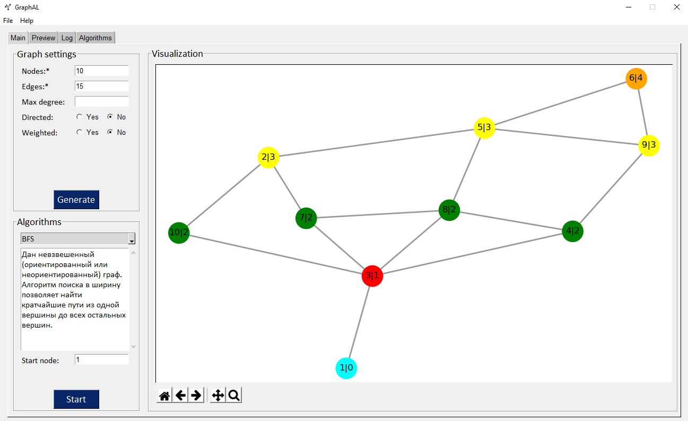
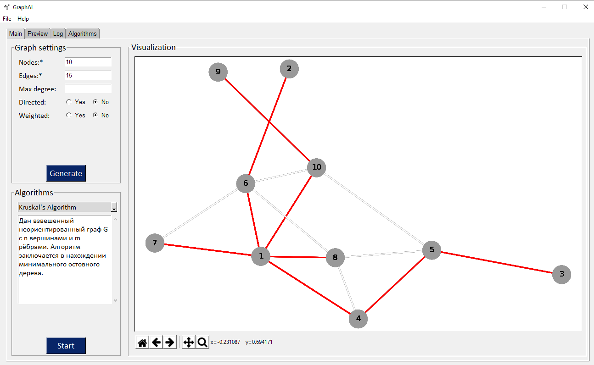

# GraphAL
### Description
GraphAL is a framework for graph algorithms visualization.  
This framework shows how work the ones of the most popular graph algorithms:
- [Depth First Search (DFS)](https://en.wikipedia.org/wiki/Depth-first_search)
- [Breadth First Search (BFS)](https://en.wikipedia.org/wiki/Breadth-first_search)
- [Dijkstra's algorithm](https://en.wikipedia.org/wiki/Dijkstra%27s_algorithm)
- [Prim's algorithm](https://en.wikipedia.org/wiki/Prim%27s_algorithm)
- [Kruskal's algorithm](https://en.wikipedia.org/wiki/Kruskal%27s_algorithm)
- [Floyd–Warshall algorithm](https://en.wikipedia.org/wiki/Floyd–Warshall_algorithm)
- [Bellman-Ford algorithm (beta)](https://en.wikipedia.org/wiki/Bellman–Ford_algorithm)
- [Ford-Fulkerson algorithm (beta)](https://en.wikipedia.org/wiki/Ford–Fulkerson_algorithm)
> Beta functions does not guarantee correct execution!

### Getting Started
First of all, you should compile two dynamic link libraries "generation.dll" and "algorithms.dll". Their source code contains in src/generation/ and src/algorithms/ folders appropriately. Those dll files should be in src/ folder. Run app.py.
Have fun!

### Dependencies
- Python v3.8+
- PySimpleGUI v4.19+
- NetworkX v2.4+
- Matplotlib v3.2+

### Examples

#### BFS algorithm

#### Kruskal's algortihm

### Collaborators
:lollipop: [**@jswark**](https://github.com/jswark) (Graph data) 
:green_apple: [**@egortrue**](https://github.com/egortrue) (Graph algorithms) 
:strawberry: [**@AndreyBakurskii**](https://github.com/AndreyBakurskii) (UI/UX design) 
